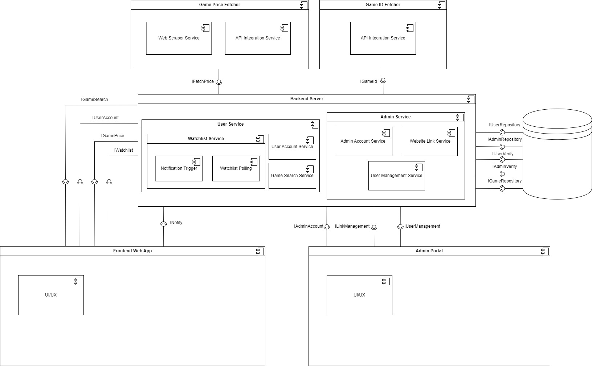
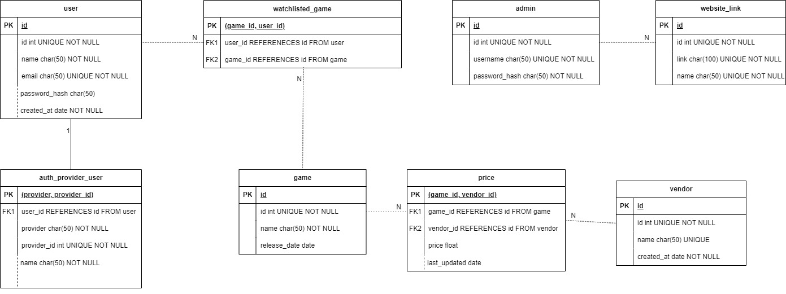
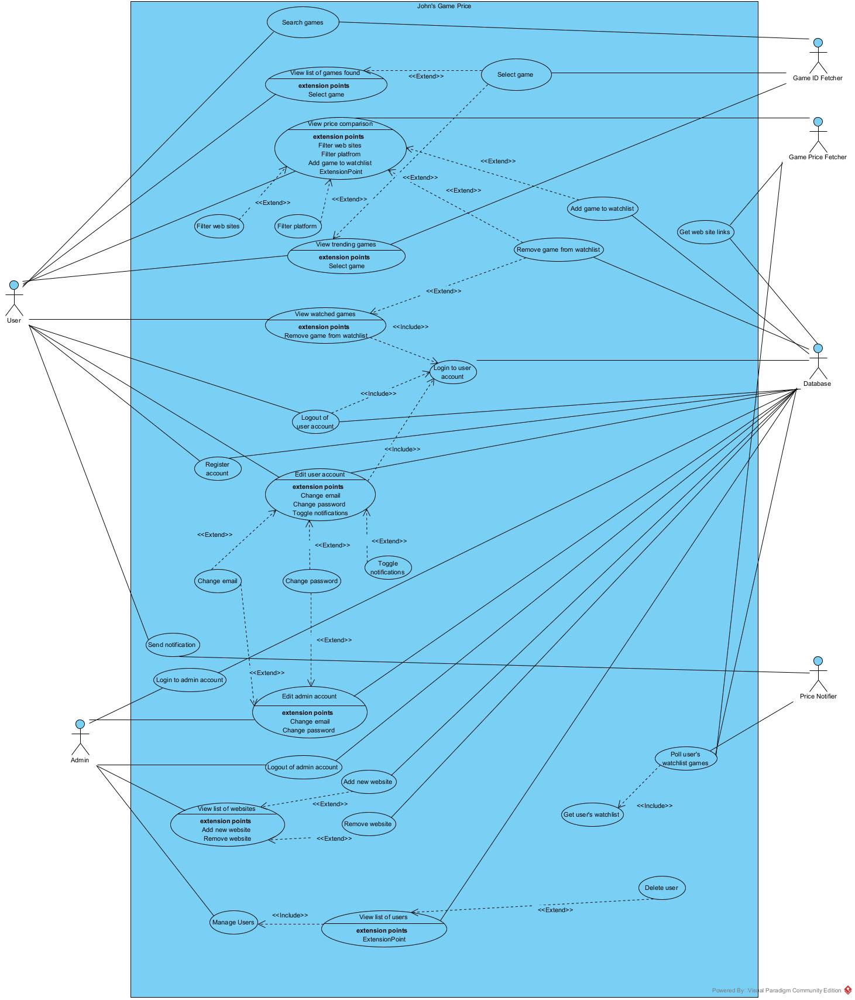

# JohnsGamePrice

A game price comparison platform built with Python microservices and React TypeScript frontend. Demonstrates modern full-stack development with clean architecture and enterprise-grade practices.

## 🎯 Project Overview

Multi-service application that aggregates game pricing information from various digital storefronts. Showcases microservices architecture, advanced Python backend development, and modern React frontend skills.

## 🏗 System Architecture (subject to change)




*Comprehensive microservices architecture showing the relationship between Game ID Fetcher, Price Fetcher services, and the React frontend.*

## 🗄 Database Design



*Entity-relationship diagram showing the data model for users, games, prices, and watchlists with proper foreign key relationships.*

## 📋 Use Cases



*Complete use case analysis covering user interactions, admin functions, and system processes for the game price comparison platform.*


## 🐍 Python Backend Services

### **Game ID Fetcher Service** (`game-id-fetcher/`)
- **IGDB API Integration**: Game metadata retrieval with OAuth2 authentication
- **FastAPI Framework**: High-performance async web service
- **Comprehensive Testing**: Unit tests with mocked external dependencies

### **Game Price Fetcher Service** (`game-price-fetcher/`)
- **Template Method Pattern**: Extensible architecture for multiple stores
- **Abstract Base Classes**: Clean interface design for price fetchers
- **Multi-Store Support**: Currently Steam with scalable architecture

### **Python Technical Stack**

| Component | Technology | Purpose |
|-----------|------------|---------|
| **Framework** | FastAPI | High-performance async API development |
| **Language** | Python 3.13 | Latest Python with enhanced type system |
| **Testing** | pytest + unittest.mock | Comprehensive testing with mocking |
| **HTTP Client** | requests | External API integration |
| **Environment** | python-dotenv | Secure configuration management |
| **Containerization** | Docker | Multi-stage production builds |

### **Design Patterns Implemented**

```python
# Template Method Pattern for extensible store support
class PriceFetcher(ABC):
    def fetch(self, game_id: str, currency: str = "GBP") -> Dict[str, Any]:
        """Template method defining the algorithm skeleton"""
        raw_data = self._get_raw_data(game_id, currency)
        return self._parse_price(raw_data)
    
    @abstractmethod
    def _get_raw_data(self, game_id: str, currency: str) -> Dict[str, Any]:
        pass
    
    @abstractmethod  
    def _parse_price(self, raw_data: Dict[str, Any]) -> Dict[str, Any]:
        pass
```

## ⚛️ React Frontend

### **Frontend Application** (`frontend/`)
- **React 18**: Modern hooks and concurrent features
- **TypeScript**: Full type safety across components and API calls
- **Vite**: Fast development with optimized builds
- **Component Architecture**: Reusable, composable UI components

### **Frontend Technical Stack**

| Component | Technology | Purpose |
|-----------|------------|---------|
| **Framework** | React 18 | Component-based UI library |
| **Build Tool** | Vite | Fast development and optimized builds |
| **Language** | TypeScript | Type-safe JavaScript development |
| **Styling** | CSS Modules | Modular and responsive styling |
| **HTTP Client** | Fetch API | Type-safe API communication |
| **Testing** | Vitest + RTL | Unit and integration testing |

### **TypeScript Integration**

```typescript
// Type-safe API integration with custom hooks
interface GamePrice {
  currency: string;
  initial: number;
  final: number;
  discount_percent: number;
  final_formatted: string;
}

const useGamePrices = (gameId: string): {
  data: GamePrice | null;
  loading: boolean;
  error: string | null;
} => {
  const [data, setData] = useState<GamePrice | null>(null);
  const [loading, setLoading] = useState(true);
  const [error, setError] = useState<string | null>(null);

  useEffect(() => {
    fetchGamePrices(gameId)
      .then(setData)
      .catch(err => setError(err.message))
      .finally(() => setLoading(false));
  }, [gameId]);

  return { data, loading, error };
};
```

## 🏗 Architecture Overview

```
JohnsGamePrice/
├── game-id-fetcher/              # Python Microservice
│   ├── src/
│   │   ├── igdb_client.py        # IGDB API integration
│   │   └── main.py               # FastAPI application
│   ├── tests/                    # Comprehensive unit tests
│   └── Dockerfile                # Multi-stage container build
│
├── game-price-fetcher/           # Python Microservice  
│   ├── src/
│   │   ├── templates/
│   │   │   └── price_fetcher.py  # Abstract base class
│   │   ├── fetchers/
│   │   │   └── steam.py          # Steam price fetcher
│   │   └── main.py               # FastAPI application
│   ├── tests/                    # Unit tests with mocking
│   └── Dockerfile                # Production-ready container
│
└── frontend/                     # React TypeScript Application
    ├── src/
    │   ├── components/           # Reusable UI components
    │   ├── hooks/                # Custom React hooks
    │   ├── services/             # Type-safe API client
    │   └── types/                # TypeScript definitions
    ├── package.json
    ├── tsconfig.json
    └── vite.config.ts
```

## 📚 API Endpoints

### **Game ID Service**
- **Search Games**: `GET /game-ids?name={game_name}`
- **Interactive Docs**: Available at `/docs` endpoint

### **Price Fetcher Service**
- **Steam Prices**: `GET /price/steam?game_id={id}&currency={currency}`
- **Supported Currencies**: USD, GBP, EUR, and more

## 🧪 Testing Strategy

### **Backend Testing**
- **Unit Tests**: Individual component testing with pytest
- **Mocking**: External API dependencies isolated
- **Coverage**: 90%+ test coverage with detailed reports

### **Frontend Testing**
- **Component Tests**: React Testing Library integration
- **Type Safety**: Comprehensive TypeScript coverage
- **Integration**: API communication testing

## 👨‍💻 Skills Demonstrated

### **Python Expertise**
- Abstract Base Classes and Template Method pattern
- FastAPI with automatic OpenAPI documentation
- Comprehensive testing with pytest and mocking
- Docker containerization with multi-stage builds
- Type hints and modern Python practices

### **React/TypeScript Expertise**
- Modern React with hooks and functional components
- Full TypeScript integration for type safety
- Custom hooks for reusable logic
- Component-based architecture
- Vite for optimized development workflow

### **Full-Stack Integration**
- Microservices architecture
- RESTful API design
- Type-safe frontend-backend communication
- Production-ready deployment strategies

## 🔮 Future Enhancements

- Additional store integrations (GOG, Epic Games)
- Real-time price tracking with WebSocket
- User authentication and price alerts
- Historical price analysis and trends
- Mobile-responsive progressive web app

---
